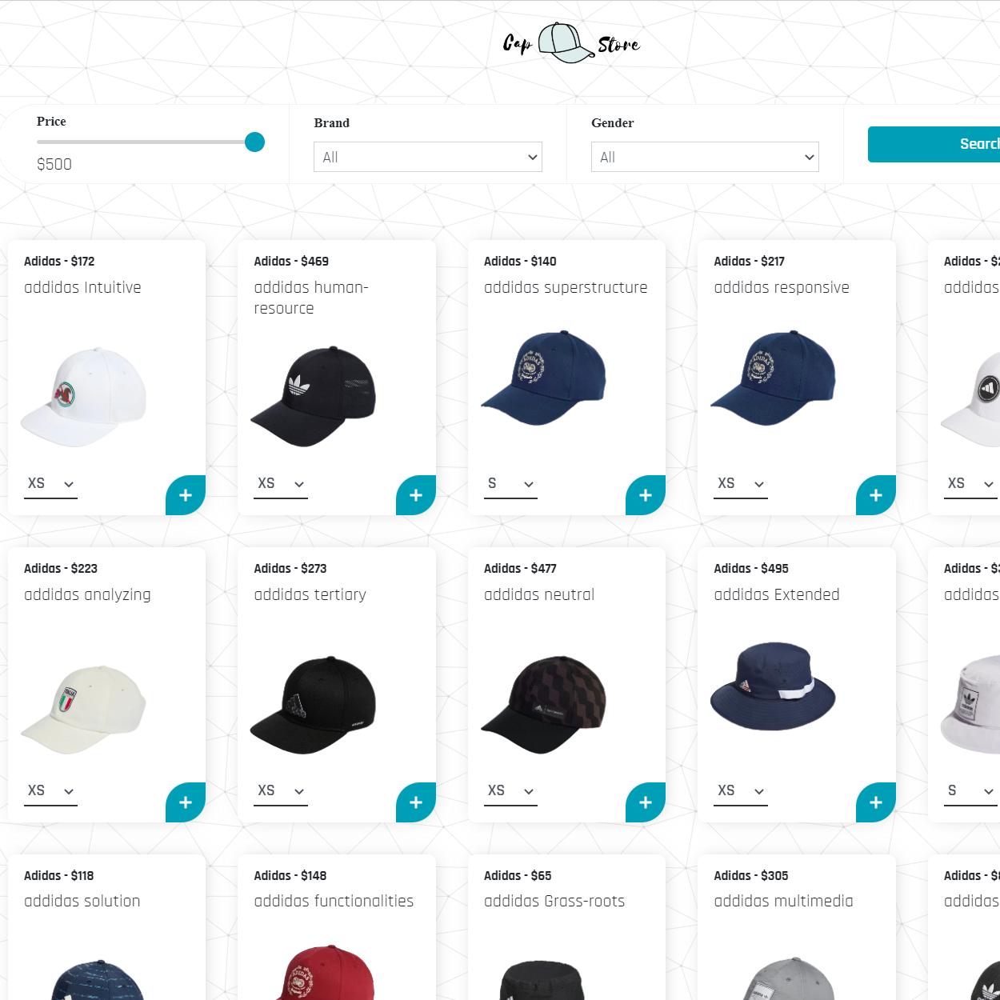
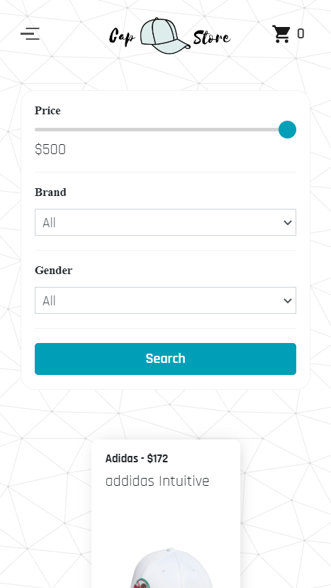

# [Cap Store](https://cap-store.netlify.app/)

Cap Store using React Hooks, Redux, and more!

## Built With 🔨

#### Front End
* React
* Redux
* Stripe
* GSAP
* Javascript
* SCSS
* Bootstrap

#### Back End
* Koa
* NodeJS

## Features ✏️

* Cart - Add and remove items from cart, cart saves to localstorage.
* Store - Filter cap by price, gender, and brand.
* Pagination - Responsive pagination and toggle results per page.

## Desktop Preview 💻

## Mobile Preview 📱

